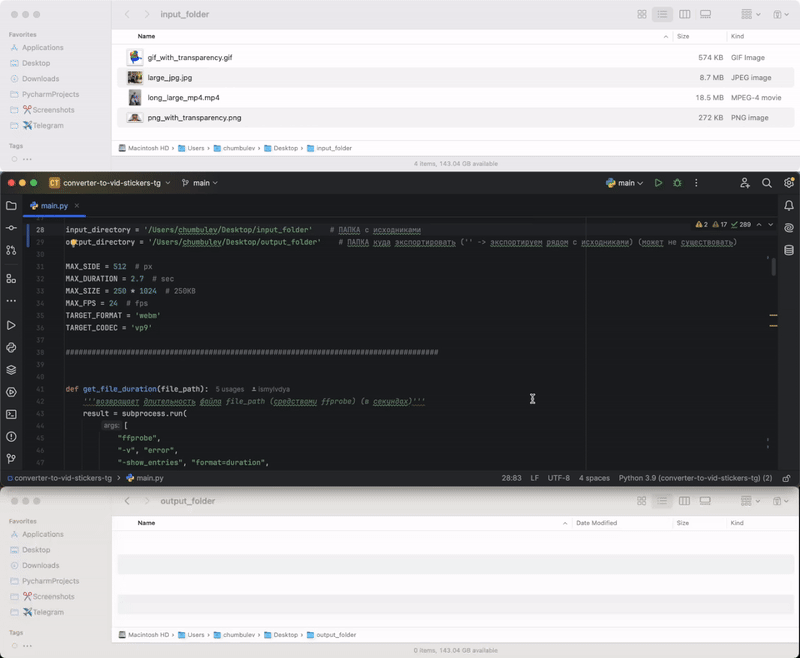
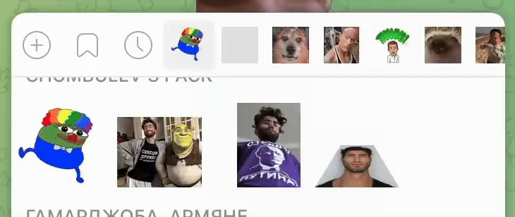

# КАРОЧЕ

скрипт проходится по всем изображениям и видосам в папке и конвертирует их в `.webm`-ки которые теперь можно вставить в свой видео(!)-стикерпак через тележного бота [@Stickers](https://t.me/Stickers)


## Преимущества
1. конвертируются не только видосы но и ИЗОБРАЖЕНИЯ (в т.ч. `.gif`) 
2. долгие видосы и гифки УСКОРЯЮТСЯ до 3-ех секунд а не тупо обрезаются
3. сохраняется прозрачность что в изображениях что в видосах


## Че делать

1. предварительно кидаешь исходники (видосы гифки и пикчи любого формата длительности веса и тд ) в какую-нить папочку

1. указываешь в начале кода свою эту папочку (`input_directory`) и папку куда экспортировать (`output_directory`). Все названия должны быть без пробелов!

   - если `output_directory = ''` то экспорт происходит в `input_directory` то есть рядом с исходниками

2. запускаешь код в IDE-шке


## Скринкаст работы




## Итоговый стикерпак




# ПОДРОБНЕЕ

## [Требования телеги](https://core.telegram.org/stickers/webm-vp9-encoding) к видео стикерам

- длительность видео не должна превышать 3 секунд
- бо́льшая из сторон видео должна равняться 512 pxl
- видео не должно иметь аудио дорожки
- видео должно быть .webm формата до 30 FPS
- видео должно быть в кодеке VP9 (оказалось что у этого кодека еще и должен быть Profile 0)
- вес видео после конвертации не должен превышать 256 KB
- ..от себя добавлю что и палитра цветов должна быть определенная (yuv420p или yuva420p) но они бля об этом не информируют


## Чем не устаривают существующие конвертеры 

все тележные боты и вариации команды `ffmpeg` из гугла конвертируют в `.webm` ТОЛЬКО ВИДОСЫ и делают это в лоб: если видео длиннее 3-ех секунд то они его тупо обрезают

этот же скрипт помимо видосов (`.mp4`, `.mov`, `.avi`, `.mkv`) конвертирует еще и изображения (`.jpg`, `.jpeg`, `.png`, `.gif`) причем длинные видосы и гифки он ускоряет до 3-ех секунд а не обрезает. То есть можно просто запустить его в папке с фотками и видосами и получить на выходе стикеры не беспокоясь за то что видео/гифки обрежутся в неожиданном месте   


## Алгоритм

каждый файл из `input_directory` с одним из вышеперечисленных расширений модифицируется следующим образом:

1. масштабируется до `MAX_SIDE` pxl если бо́льшая сторона не равна `MAX_SIDE`  
2. ускоряется до `MAX_DURATION` sec если его длительность больше (для видео и гиф)
3. в цикле (пока вес не станет меньше `MAX_SIZE`): 
   1. конвертируется в `.webm` (с кодеком `VP9 Profile 0` и цветовой палитрой `yuva420p` которая сохраняет прозрачность) в папку `output_directory` и заданными fps и битрейтом (на первой итерации fps = `MAX_FPS`, битрейт = `1000`)
   2. если после этого вес `.webm` всё еще больше `MAX_SIZE` то текущий fps уменьшается на `2` а текущий битрейт уменьшается на `100`
   > ⚠️ ОБРАЩАЮ ВНИМАНИЕ️
   >
   > вес при конвертации `.png` и `.jpg` не отслеживается. Потому что мне лень. Но исследования на достаточно большой выборке изображений (3 шт) показали что ниче страшного так как для того чтобы итоговый .webm был тяжелее 256 KB исходное изображение должно весить порядка 20 MB а это оч маловероятно


скрипт **не изменяет** и **не удаляет** исходные файлы. Результатом его работы являются только появившиеся/перезаписанные `.webm`-ки в аутпут-папке

сохранение прозрачности проверено на `.png` и `.gif`


## Реквайерменто́сы

1. на компьютере должен быть установлен `ffmpeg` (фреймворк для работы с медиафайлами): 
    ```bash
    brew install ffmpeg
    ```

2. к проекту же необходимо подключить лишь библиотеку `moviepy` (также необходимые `numpy`, `PIL` и остальные установятся автоматически при инсталлировании `moviepy`)


<details>
<summary>точные версии используемых пакетов, пайтона и тд</summary>

ffmpeg 7.1

Python 3.9

скрипт проверялся только в PyCharm 2024.2.1 на MacOS 12.7.4

| Package | Version    |
|---------|------------|
| certifi | 	2024.8.30 |
|charset-normalizer|	3.4.0|	
|decorator|	4.4.2	|
|idna	|3.10	|
|imageio|	2.36.0	|
|imageio-ffmpeg|	0.5.1|	
|**moviepy**|	**1.0.3**	|
|numpy	|2.0.2	|
|pillow	|11.0.0	|
|pip	|23.2.1	|
|proglog|	0.1.10|	
|requests|	2.32.3|	
|setuptools|	68.2.0|	
|tqdm	|4.67.0	|
|urllib3|	2.2.3|	
|wheel|	0.41.2	|

</details>


